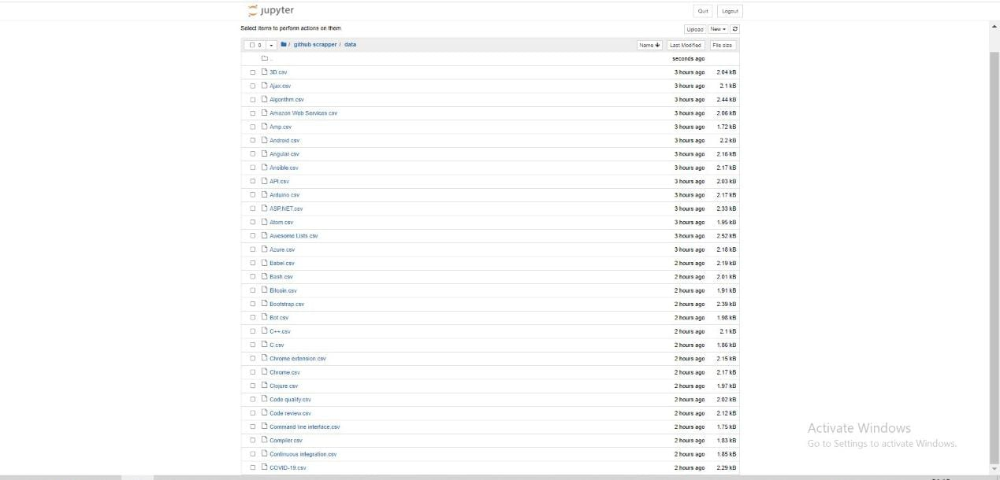
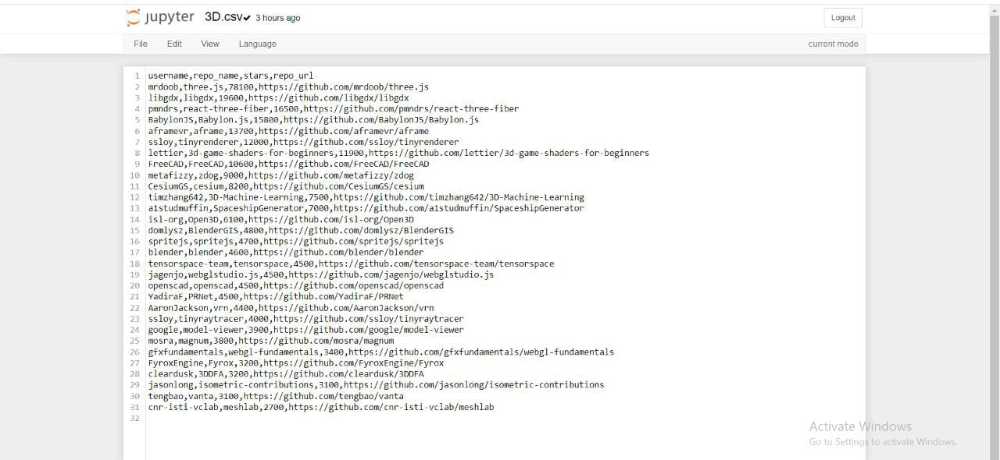

# Github-Scrapper

We're going to scrape https://github.com/topics <br/>
- We'll get a list of topics. For each topic, we'll get topic title, topic page URL and topic description<br/>
- For each topic, we'll get the top 25 repositories in the topic from the topic page</br>
- For each repository, we'll grab the repo name, username, stars and repo URL</br>
- For each topic we'll create a CSV file in the following format:</br>
```
Repo Name,Username,Stars,Repo URL
three.js,mrdoob,69700,https://github.com/mrdoob/three.js
libgdx,libgdx,18300,https://github.com/libgdx/libgdx
```

## Output of the project after scrapping in .csv format

)

## opened first csv file output :- 


## Motivation of making this project 
- I always wanted to learn how web scraping works with the help of Python , Beautiful Soup and Pandas.

## Wrote a blog on medium , Here's the link of the blog :-
https://medium.com/@nehasinha18y18/web-scraping-1093d94dd02d
